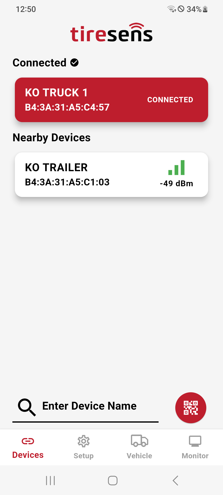

# Devices Screen

The Devices Screen provides the following information for each detected receiver:

- **Signal Strength (RSSI):** Bars and numerical values indicating proximity.
- **Device Name:** Custom or default names, such as "NLP200" or "LRX200."
- **MAC Address:** Matches the label on the receiver for identification.

## Key Features

- **Filtering Devices:** Quickly find devices by filtering their names.
- **Connecting to a Device:** Tap a device from the list or scan the receiver’s QR code for direct connection.

{width="200px"}
