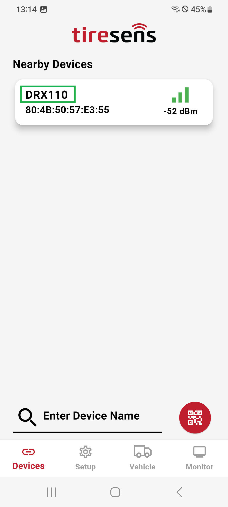
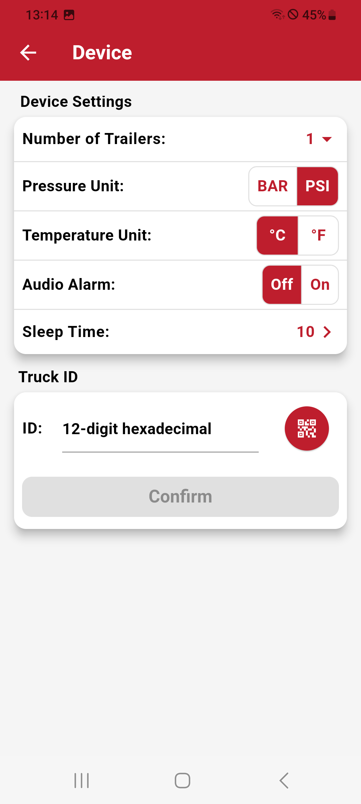

# In-Cab Display Configuration

The **In-Cab Display** can also be configured through this app to work seamlessly with a truck receiver. Below is a guide to setting up and configuring the display:

## Linking the In-Cab Display to a Truck Receiver

**Device Identification:**

- The in-cab display will appear in the **Devices Screen** with the name **DRX110**.
- Select the **DRX110** device to connect.

**Access to Setup:**

- Once connected and on the **Setup Screen** you can update the device firmware or configure its settings.

## In-Cab Display Settings

The following settings can be configured for the in-cab display:

**Number of Trailers:**

- Set the number of trailers the display should support.
- Adjustable from **0** to **7** trailers.

**Pressure Unit:**

- Choose the pressure unit to be displayed, such as **bar** or **psi**.

**Temperature Unit:**

- Set the temperature unit, either **Celsius (°C)** or **Fahrenheit (°F)**.

**Audio Alarm:**

- Enable or disable the audio alarm.
- When enabled, the display will emit an alarm sound during warnings or alerts.

**Sleep Time:**

- Configure how quickly the display should turn off when inactive.
- This helps conserve power.

## Linking the Display to a Truck Unit

After configuring the settings, the in-cab display must be linked to a truck receiver for full functionality:

**Add the Truck MAC ID:**

- Use the app to enter the truck unit’s **MAC ID**.

Input methods:

- **Typing:** Manually enter the MAC ID in the provided field.
- **QR Code:** Scan the QR code associated with the truck unit to automatically input the MAC ID.

| **In-Cab Display Device Name**       |**In-Cab Display Settings**     |
|:----------------------:|:----------------------:|
| {width="200px" style="border: 1px solid black; border-radius: 30px; padding: 5px; background-color: #000;"} |{width="200px" style="border: 1px solid black; border-radius: 30px; padding: 5px; background-color: #000;"} |
