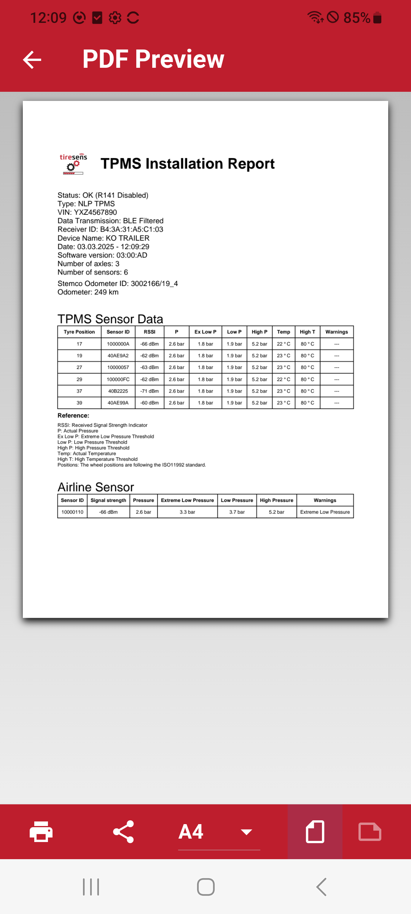

# TPMS Installation Report

After the successful installation of the TPMS system, a detailed installation report can be generated. This report includes all relevant information about the system and its components, ensuring proper functionality and documentation.

## Report Contents

- **Installation Status:** Confirms whether the installation is successful.
- **System Type:** Specifies the TPMS type used.
- **Vehicle Identification Number (VIN):** Identifies the vehicle where the system is installed.
- **Data Transmission Method:** Indicates how the TPMS data is transmitted (e.g., BLE Filtered).
- **Receiver Information:** Includes the Receiver ID and associated device name.
- **Installation Date & Time:** Provides a timestamp of the installation.
- **Software Version:** Displays the TPMS software version.
- **Axle & Sensor Count:** Details the number of axles and installed sensors.
- **Odometer Readings:** Records mileage and Stemco Odometer ID if applicable.

## TPMS Sensor Data

Each sensor's data is included in the report, detailing:

| Tyre Position | Sensor ID | Signal Strength (RSSI) | Actual Pressure (P) | Extreme Low Pressure | Low Pressure | High Pressure | Temperature (°C) | High Temp Threshold | Warnings |
|--------------|-----------|----------------------|------------------|-------------------|------------|------------|---------------|-----------------|----------|
| 17   | 1000000A  | -64 dBm             | 2.6 bar          | 1.8 bar           | 1.9 bar    | 5.2 bar    | 22 °C         | 80 °C           | ---      |
| 19   | 40AE9A2   | -61 dBm             | 2.6 bar          | 1.8 bar           | 1.9 bar    | 5.2 bar    | 23 °C         | 80 °C           | ---      |

> **Note:** The wheel positions follow the ISO11992 standard.

## Airline Sensor Data

If applicable, airline sensors are also included with similar parameters:

| Sensor ID | Signal Strength | Pressure | Extreme Low Pressure | Low Pressure | High Pressure | Warnings |
|-----------|----------------|----------|----------------------|--------------|--------------|----------|
| 10000110 | -68 dBm        | 2.6 bar  | 3.3 bar              | 3.7 bar      | 5.2 bar      | Extreme Low Pressure |

This report ensures compliance, transparency, and ease of troubleshooting. It can be saved for future reference or shared for documentation purposes.

| **Report (R141 disabled)**       |**Report (R141 enabled)**      |
|:----------------------:|:----------------------:|
| {width="300px" style="border: 1px solid black; border-radius: 30px; padding: 5px; background-color: #000;"} |{width="300px" style="border: 1px solid black; border-radius: 30px; padding: 5px; background-color: #000;"} |

| **Example Report**       |
|:----------------------:|
| {width="600px" style="border: 0.01px solid black;  padding: 1px; background-color: #000;"} |
