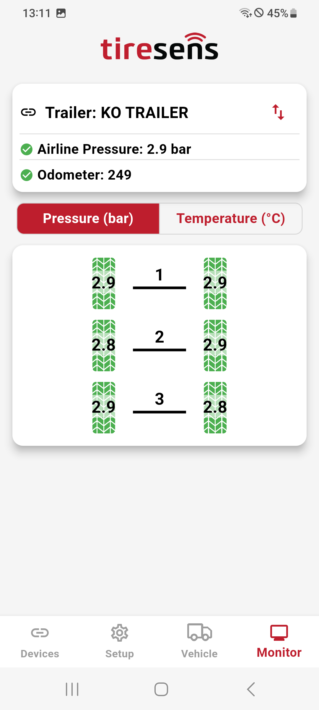
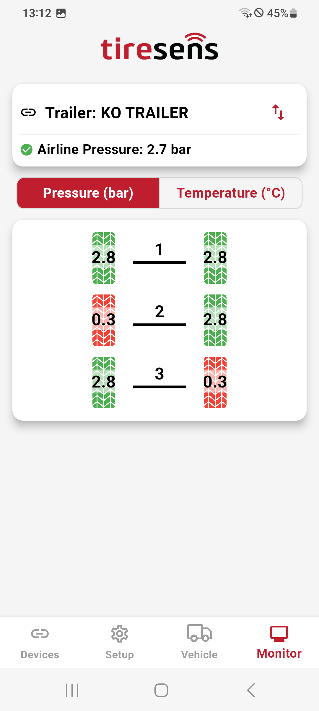
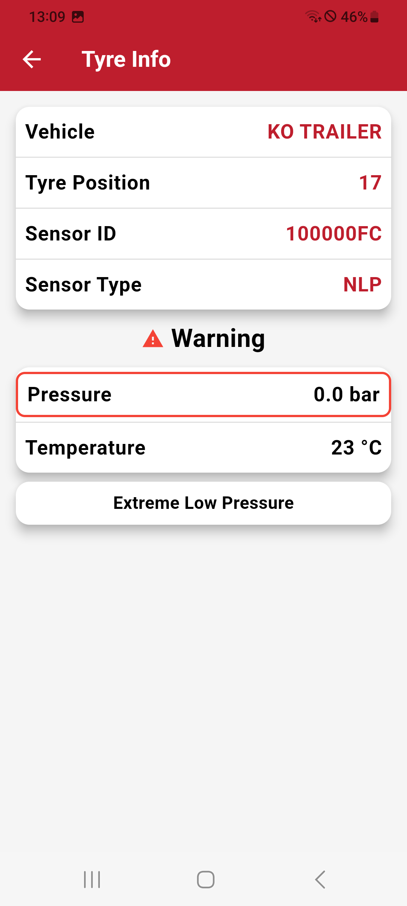
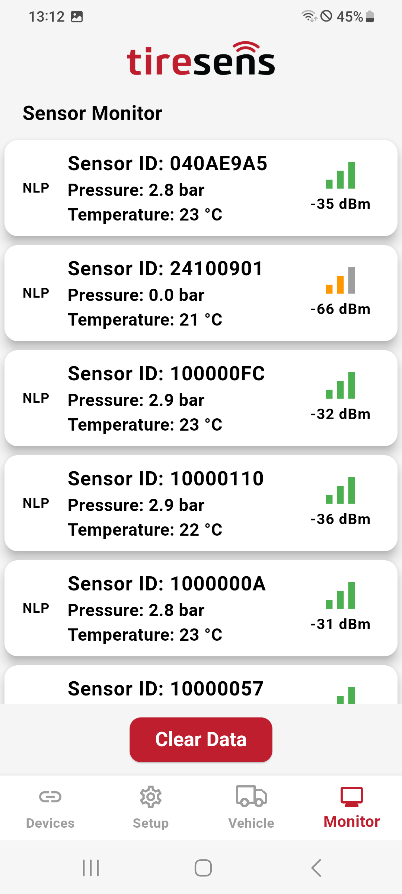

# Monitor Screen

The Monitor Screen provides real-time updates and status information about the connected device and sensors. It adapts its display based on the communication type (**Filtered** or **Unfiltered**). Below are the details for both modes:

## Filtered Devices

### Vehicle Specific Data

For **Filtered Devices**, the Monitor Screen displays vehicle-specific data and tire sensor information in an organized layout.

- Shows the type of vehicle (e.g., truck or trailer) currently being monitored.
- Displays the name of the vehicle for easy identification.

### Trailer-Specific Details

- If the trailer is equipped with an Airline Sensor, the status and pressure of the airline will be displayed.
- If the trailer has an Odometer setup, the current odometer value will also be visible.

### Sensor and Tire Data

The lower section shows the vehicle layout with the data received from the connected sensors.
Each tire displays its current pressure or temperature value above it.

### Status Indicators

- Green: Indicates everything is operating within normal thresholds.
- Yellow: Represents a warning state requiring attention.
- Red: Signals a critical issue that must be addressed immediately.

### Tire Details and Warnings

By clicking on a tire, you can access more detailed information, including:

- **Sensor ID**
- **Sensor type**
- **Active warnings or issues**
  
This allows for quick diagnostics and resolution of any problems.

### Multiple Vehicle Support (Truck with Trailers)

If a truck has one or more connected trailers, you can swipe horizontally to view the data for each vehicle in the chain.

## Unfiltered Devices

For **Unfiltered Devices**, the Monitor Screen does not show a vehicle layout. Instead, it displays a simple list of received sensor data:

### Sensor Information List

When a sensor is detected, the following information is displayed in the list:

- **Sensor ID**
- **Sensor type**
- **Pressure value**
- **Temperature value**
- **Signal Strength**

This mode provides a raw, unstructured view of sensor data without vehicle-specific configurations.

| **Filtered Device (all OK and Trailer)**       |**Filtered Device (warning)**     |
|:----------------------:|:----------------------:|
| {width="200px" style="border: 1px solid black; border-radius: 30px; padding: 5px; background-color: #000;"} |{width="200px" style="border: 1px solid black; border-radius: 30px; padding: 5px; background-color: #000;"} |
| **Tire Details**    |**Sensor List (unfiltered device)**       |
| {width="200px" style="border: 1px solid black; border-radius: 30px; padding: 5px; background-color: #000;"} |{width="200px" style="border: 1px solid black; border-radius: 30px; padding: 5px; background-color: #000;"} |
