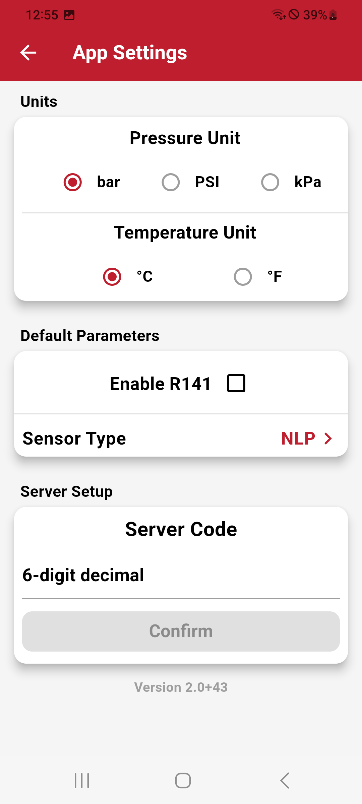

# App Settings

Customize your app preferences:

- **Units:** Choose your preffered pressure (PSI/Bar/kPa) and temperature (Celsius/Fahrenheit) units.
- **Default Sensor Type:** Specify the default sensor type for later vehicle setups.
- **R141 TPMS Compliance:** Enable or disable regulatory compliance features.

!!! note "R141 support"

    Please talk to your distributor for details!

{ width="300px"}
