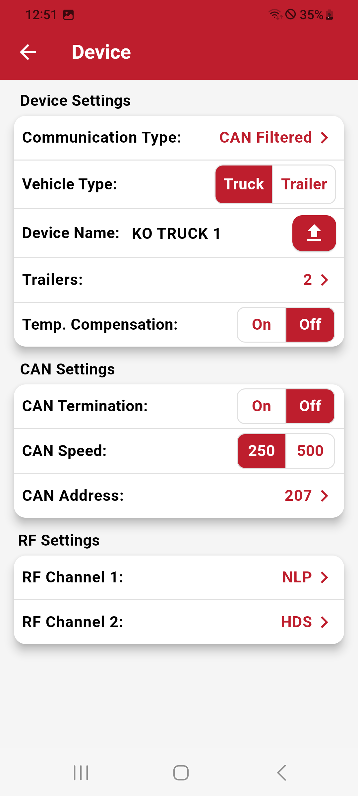
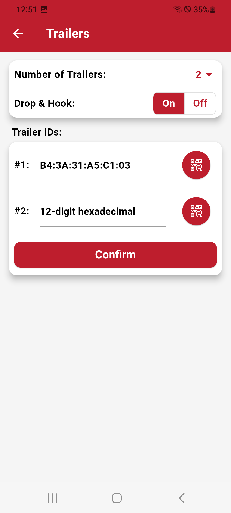

# Device Configuration

The Device Menu enables in-depth configurations:

- **Communication Types:**

Each communication type utilizes a specific transmission method to send the data:

>BLE (2.4GHz): Transmits data wirelessly using BLE technology.  
CAN (Controller Area Network): Communicates over a CAN bus, commonly used in automotive environments.  
RS232: Transmits data through a serial connection.

| **Type**       | **Mode**      | **Description**|
|-----------------|--------------|----------------------------------|
| **BLE**         | Filtered      | Allows setup of a vehicle and its tires, only displays/transmits sensors for this setup.  |
|                 | Unfiltered    | Displays/Transmits all sensors around without a vehicle layout.                          |
| **CAN**         | Filtered      | Allows setup of a vehicle and its tires, only displays/transmits sensors for this setup.        |
|                 | Unfiltered    | Displays/Transmits any sensor data without a specific layout.                            |
|                 | CAN Garage    | A specific CAN mode tailored for garage or workshop environments.|
|                 | EBS    | A specific CAN mode tailored for Trailer EBS systems. Allows setup of a trailer and its tires, only displays/transmits sensors for this setup.|
|                 | RAW    | Custom communication types tailored for specific use cases.|
|                 | J1939    | A specific CAN mode tailored for J1939 systems. Allows setup of a trailer and its tires, only displays/transmits sensors for this setup.|
| **RS232**       | Filtered      | Allows setup of a vehicle and its tires, only displays/transmits sensors for this setup.|
|                 | Unfiltered    | Displays/Transmits all sensor data without any predefined configuration.|

- **Vehicle Setup:** Assign a vehicle as a truck or trailer.
- **Temperature Compensation:** Adjust pressure readings based on temperature.
- **RF Settings:** Configure single or dual RF channels with specific sensor communication type.

For Trucks only:

- **Number of Trailers,** specify the number of trailers (0–7).
- **Enable Drop and Hook,** for automatic trailer detection and ordering.
- **Input Trailer MAC IDs,** manually or via QR codes.

For CAN only:

- **CAN Termination:** Enables or disables termination resistance, essential for maintaining signal integrity on the CAN bus.
- **CAN Speed:** Selectable speeds of 250 kbps or 500 kbps, accommodating different CAN network standards.
- **CAN Address:** Configurable CAN IDs to avoid conflicts and ensure proper communication in multi-device environments.

Device Name:

- **Device Name:** Matching the unique identifier of the vehicle in the fleet

| **Device Menu**       | **Trailer Menu**     |
|:----------------------:|:--------------------:|
| {width="300px" style="border: 1px solid black; border-radius: 30px; padding: 5px; background-color: #000;"} | {width="300px" style="border: 1px solid black; border-radius: 30px; padding: 5px; background-color: #000;"} |
