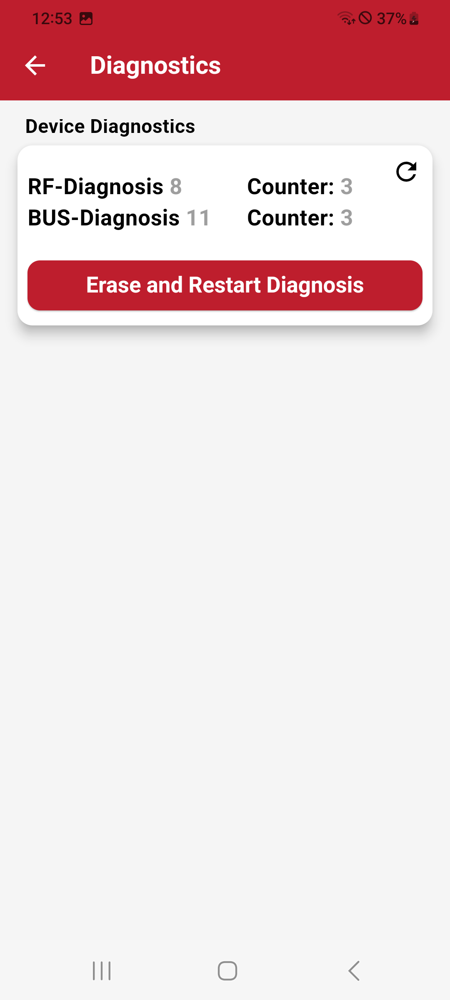

# Diagnostics

The Diagnostics Menu provides detailed device insights:

- **Error Type:** Description of detected issues.
- **Counter:** Number of occureneces.

## Actions

- **Refresh:** Update diagnostics data with latest info .
- **Erase and Restart:** Erase and restart existing diagnostics data.

{.center width="300px"}
