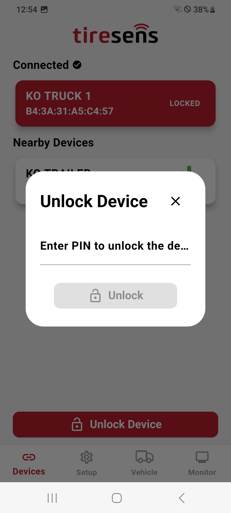

# Lock with PIN

Secure your receiver by setting a 4-digit PIN:

- **Enable PIN:** Enter a PIN to lock the device.
- **Disable PIN:** Clears the PIN when security is no longer needed.
- **Access:** The PIN is required to unclock the device at reconnection (see below).
  
| **Locked Device**     |   |
|:----------------------:|:--------------------:|
| {width="200px" style="border: 1px solid black; border-radius: 30px; padding: 5px; background-color: #000;"} | {width="200px" style="border: 1px solid black; border-radius: 30px; padding: 5px; background-color: #000;"} |
