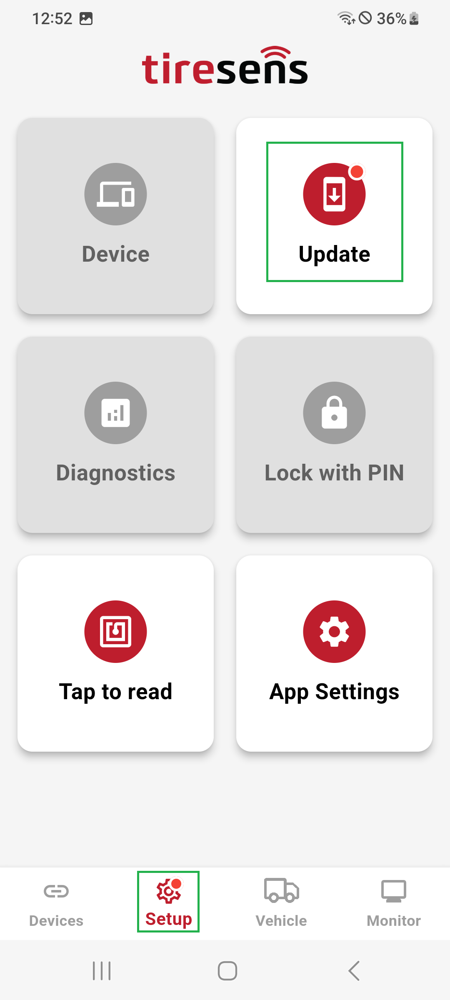

# Update Menu

A red dot on the **Setup** or **Update Menu** icon indicates available firmware updates for the connected device.

- **Automatic Updates:** The app fetches the latest firmware version from the server and displays the current and available firmware versions.
- **Manual Updates:** Upload firmware stored on your device for custom configurations.

## Update Process

1. The update progress is visually displayed by a circular progress indicator.
2. The receiver reboots and reconnects automatically upon update completion.

| **Update Menu**       |**Update Available**       |
|:----------------------:|:----------------------:|
| {width="200px" style="border: 1px solid black; border-radius: 30px; padding: 5px; background-color: #000;"} |{width="200px" style="border: 1px solid black; border-radius: 30px; padding: 5px; background-color: #000;"} |
