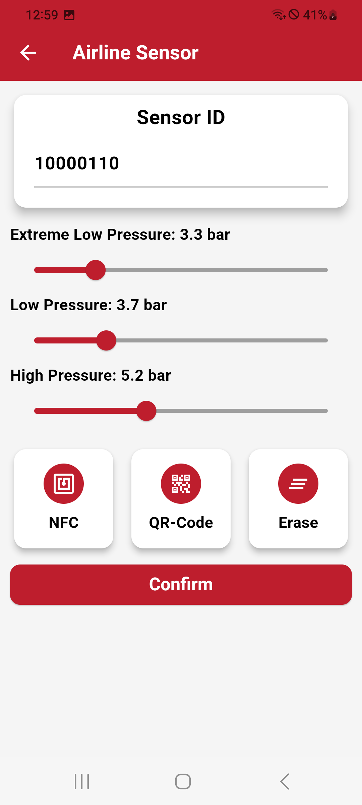

# Airline Sensor Setup

The Airline Sensor menu allows you to configure the Airline Sensor by assigning sensors ID and warning threshold.

## Assign Airline Sensor ID

You can set up the Airline Sensor by adding the sensor ID. There are multiple ways to input the sensor ID:

### Manually Typing

Enter the sensor ID directly into the input field.

### Scanning QR Code

Use the device’s camera to scan the QR code associated with the sensor, automatically inputting the sensor ID.

### Using NFC

Tap the NFC-enabled sensor to the device to read and assign the sensor ID quickly.

## Set Warning Thresholds

Choose the appropriate sensor type from a list of available options.
This allows the system to recognize the specific capabilities and features of the assigned sensor.

### Available Thresholds

- **Extreme Low Pressure:** Critical minimum pressure below which immediate action is required.
- **Low Pressure:** A warning below the optimal pressure range.
- **High Pressure:** A warning for exceeding the recommended pressure range.

| **Airline Sensor Menu**       |
|:----------------------:|
| {width="300px" style="border: 1px solid black; border-radius: 30px; padding: 5px; background-color: #000;"} |
