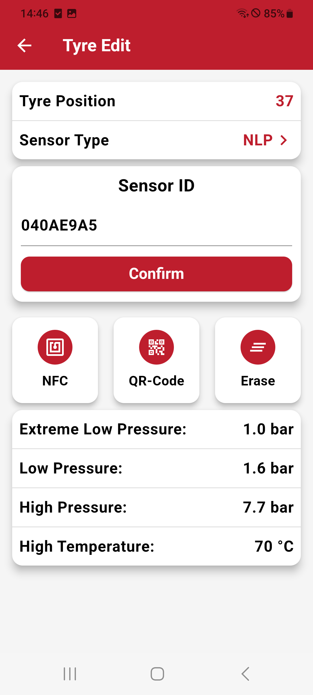

# Edit Tire

The Edit Tire menu allows you to configure individual tires by assigning sensors ID and type.

## Assign a Sensor to the Tire

You can set up the sensor for the selected tire by adding the sensor ID. There are multiple ways to input the sensor ID:

### Manually Typing

Enter the sensor ID directly into the input field.

### Scanning QR Code

Use the device’s camera to scan the QR code associated with the sensor, automatically inputting the sensor ID.

### Using NFC

Tap the NFC-enabled sensor to the device to read and assign the sensor ID quickly.

## Select Sensor Type

Choose the appropriate sensor type from a list of available options.
This allows the system to recognize the specific capabilities and features of the assigned sensor.

## Displayed Tire Information

Fhe following details are displayed for the tire:

- **Sensor ID:** The unique identifier for the assigned sensor.
- **Sensor Type:** The type of sensor configured for the tire.
- **Warning Thresholds:** Displays the configured thresholds (e.g., pressure, temperature) for that specific tire.
- **Position:** The tire’s position on the vehicle is displayed using the ISO position standard

| **Edit Tire Menu**       |
|:----------------------:|
| {width="200px"} |
