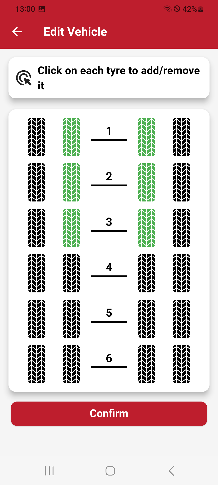

# Edit Vehicle

When you access the Edit Vehicle function, you are guided through a step-by-step process to configure your vehicle layout and warning thresholds. Below is a detailed breakdown of the process:

## Step 1: Select Vehicle Layout

The first screen allows you to define your vehicle layout

- Select the number and arrangement of tires by typing the desired configuration.
- This layout represents the specific vehicle setup (e.g., truck or trailer) you wish to monitor.

## Step 2:  Set Warning Thresholds

Once the vehicle layout is configured, the next screen allows you to set warning thresholds for tire monitoring:

### Available Thresholds

- **Extreme Low Pressure:** Critical minimum pressure below which immediate action is required.
- **Low Pressure:** A warning for tires operating below the optimal pressure range.
- **High Pressure:** A warning for tires exceeding the recommended pressure range.
- **High Temperature:** Alerts for excessive tire temperatures, which could indicate overheating.

### Configuration Options

- **Per Axle Configuration:** Set individual threshold values for each axle based on its specific requirements.
- **Apply to All Axles:** Quickly apply the same threshold values to all axles in the vehicle layout for consistency.

## R141 Support Settings

If the R141 Support setting is enabled, the available configurations are adjusted to comply with the regulatory requirements of the UN R141 standard:

- You can only set the Placard Pressure (recommended tire pressure) and High Temperature Threshold.

| **Select Vehicle Layout**       |**Set Warning Thresholds**      |
|:----------------------:|:----------------------:|
| {width="200px"} |{width="200px"} |
