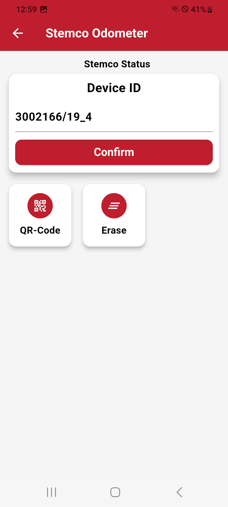

# Odometer Setup

The Odometer Menu provides a straightforward way to configure the odometer for trailer vehicles. Here's a breakdown of its functionality:

## Set Odometer ID

You can assign the odometer ID using one of the following methods:

### Manually Typing

Enter the odometer ID directly into the input field for precise configuration.

### Scanning QR Code

Use the device's camera to scan the QR code associated with the odometer, allowing for quick and error-free input of the ID.

| **Odometer Setup Menu**       |
|:----------------------:|
| {width="200px"} |