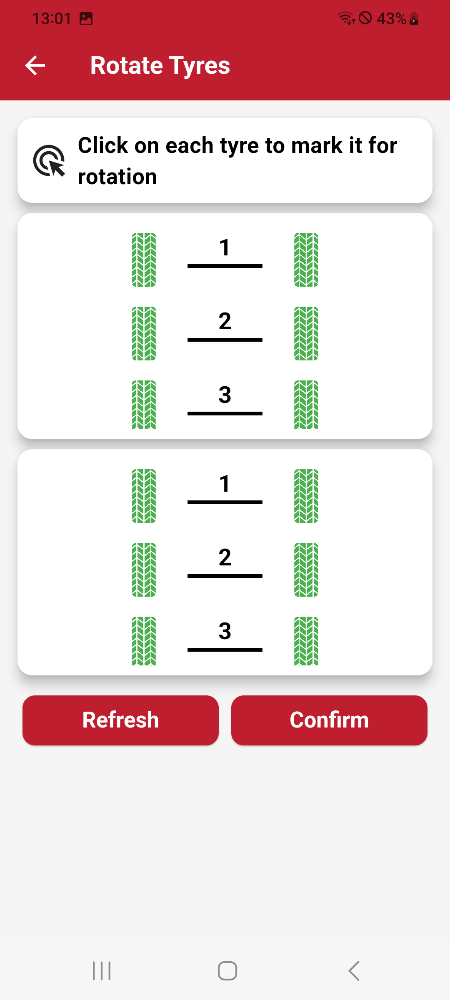

# Rotate Tires

The Rotate function allows you to reassign the positions of sensors on the vehicle. This is useful for reconfiguring tire placements after rotation or replacement. Here's how it works:

- The vehicle layout is displayed twice: one above the other.
- In the upper layout, select the tire you want to move. The selected tire will be marked with a number, indicating it is ready for reassignment.
- In the lower layout, choose the new position for the selected tire. The tire will then be moved to the chosen position, updating the sensor configuration accordingly.
This process ensures a quick and accurate reassignment of sensor positions on the vehicle.

| **Rotate Tires Menu**       |
|:----------------------:|
| {width="200px"} |
