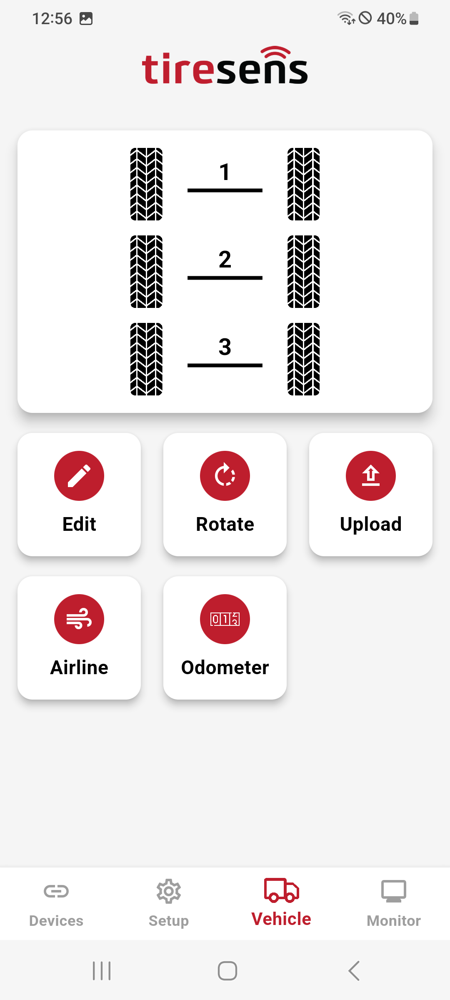
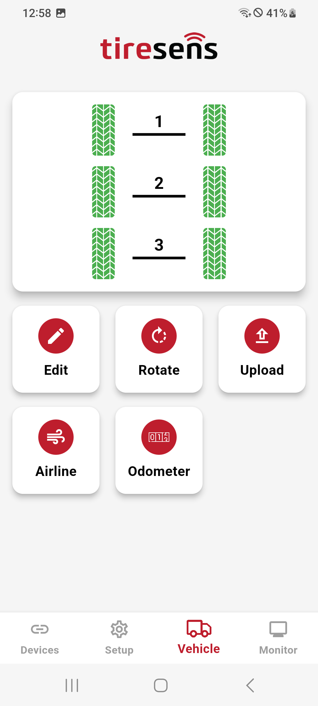
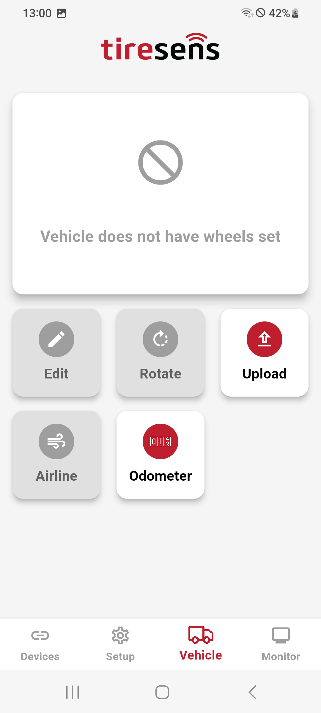

# Overview

The Vehicle Screen dynamically adjusts its functionality based on the device communication type and the vehicle type (truck or trailer). Below are the available options for Filtered and Unfiltered devices.

## Filtered Devices

If the device supports a Filtered mode, the following features are available:

### [Edit Vehicle](editVehicle.md)

- Use the Edit button to set up a vehicle layout (e.g., truck or trailer).  
- Configure tires by selecting them on the screen and setting warning thresholds. These settings are detailed in a separate page.

### [Edit Tire](editTire.md)

- After setting up the vehicle, tap each tire position to assign the sensor ID and sensor type to it.
- Once the sensor ID is assigned to all tires, the setup is complete, and the tires turn green.

### [Rotate Tires](rotate.md)

- The Rotate button allows you to change the positions of sensors within the vehicle layout. For example, if sensors need to be swapped between tires.
  
### Upload Configuration

- The Upload button sends the complete vehicle configuration to the server. This includes:
  
    - Device name
    - Warning thresholds
    - Sensor IDs
    - Sensor types

### Trailer-Specific Functions

#### [Airline Sensor Setup](airline.md)

- Available for trailers only.
- You can add the airline sensor ID and configure its warning thresholds (explained in detail on a separate page).

#### [Odotmeter Setup](odotmeter.md)

- Available for trailers only.
- Add the Odometer ID and configure it via a dedicated page.

## Unfiltered Devices

If the device supports a Unfiltered mode, the following features are available:

- Upload Configuration
- Odometer Setup (Available for trailers only)

| **Vehicle Menu**       |**Setup not complete** (black tires)      |
|:----------------------:|:----------------------:|
| {width="200px"} |{width="200px"} |
| **Setup complete** (green tires)       |**Unfiltered Devices**       |
| {width="200px"} |{width="200px"} |
